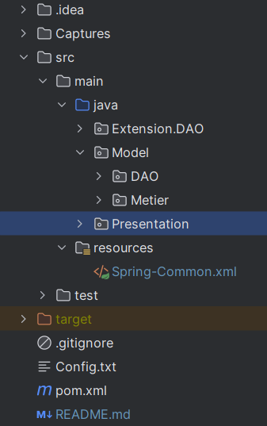
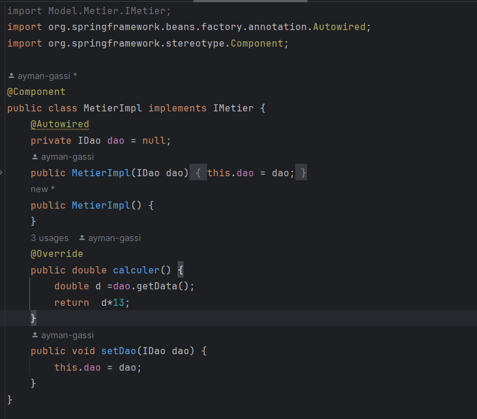

# TP01
## Project Structure

## Diagram

## I - Folder [ Model ]
### DAO
#### Interface DAO

#### Implementation DAO

### METIER
#### Interface METIER

#### Implementation METIER

## II - Folder [ Extension ]
#### Implementation DAO

## II - Folder [ Presentation ]
### Main V1 ( Statique )

### Main V2 ( Config.txt )

### Main V2 ( Spring-Common.xml )

### Main V3 ( Spring Annotations )

