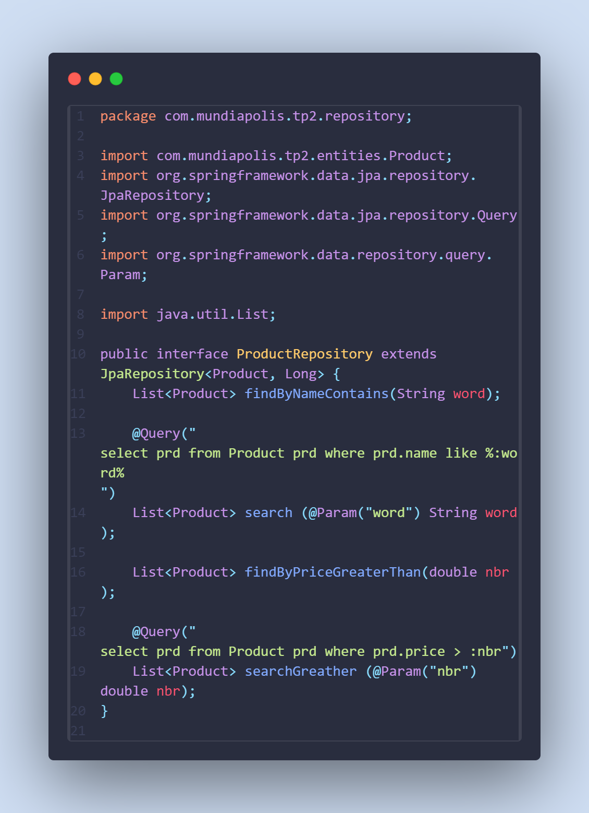
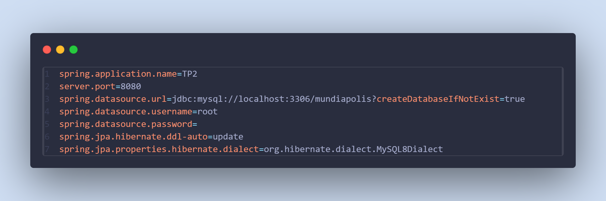
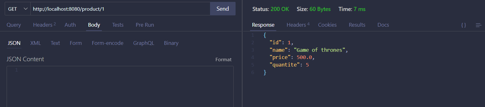
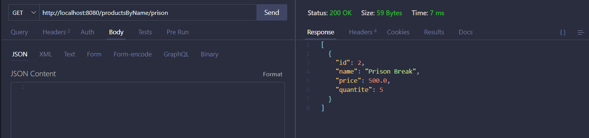
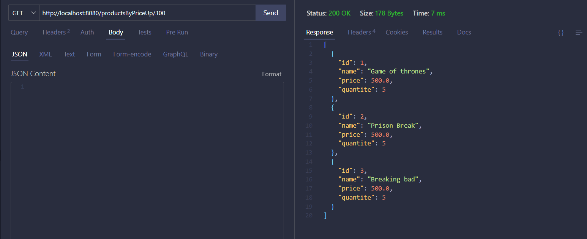
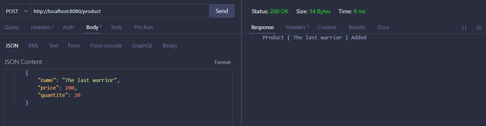

# Introduction
## Spring Data JPA
Spring Data JPA simplifie l'accès aux bases de données en offrant une abstraction au-dessus de JPA. Il permet de créer des interfaces de repositories pour effectuer des opérations CRUD sans écrire de code SQL. Cela facilite la gestion des données et améliore la productivité.

## Hibernate
Hibernate est une implémentation de JPA qui assure le mapping objet-relationnel (ORM). Il permet de mapper des objets Java à des tables de base de données, générant automatiquement les requêtes SQL. Hibernate gère aussi les transactions et le cache des données.

## Services dans Spring Boot
Les services, contiennent la logique métier d'une application. Ils interagissent avec les repositories pour manipuler les données et isolent la logique métier des autres couches comme les contrôleurs ou les repositories.

# Project Structure

# Entity

# Repositorie

# Service

# Application properties

# Testing
## select all products

## Select product by id

## Select product by name

## Select product where price greater than a num

## Add a product

