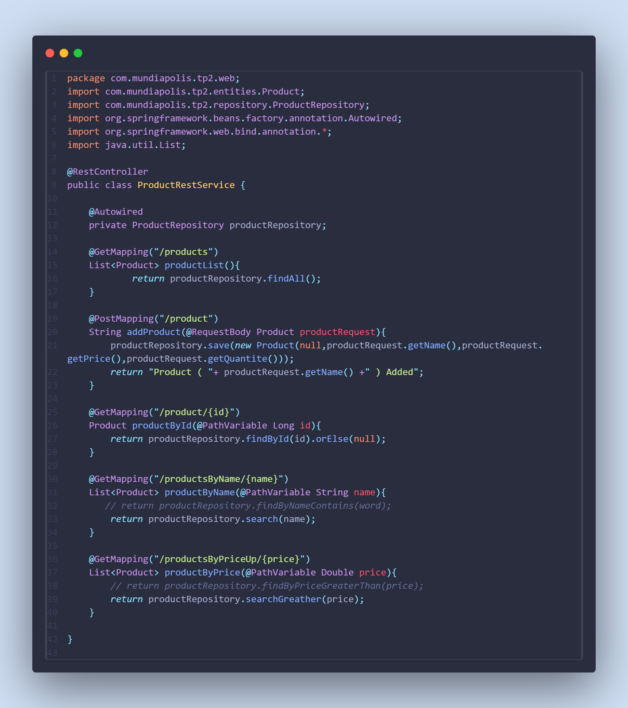
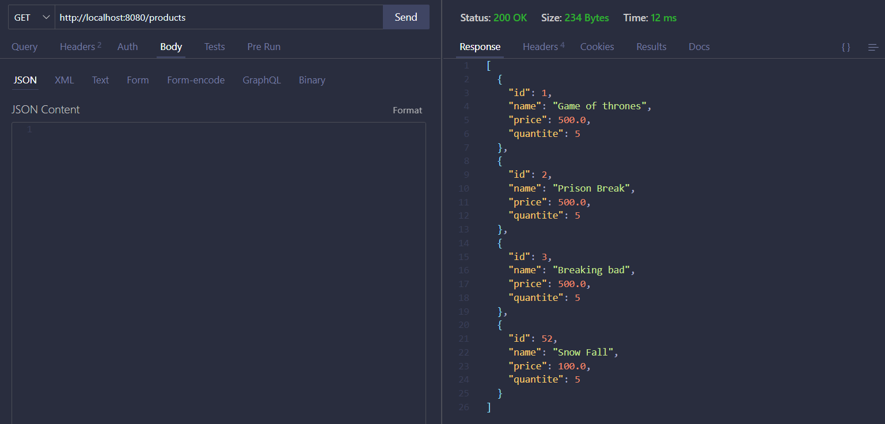

## Spring Data JPA
Spring Data JPA simplifies database access by providing an abstraction layer on top of JPA. It allows developers to create repository interfaces to perform CRUD operations without writing SQL code, making data management easier and boosting productivity.

## Hibernate
Hibernate is a JPA implementation that handles object-relational mapping (ORM). It maps Java objects to database tables, automatically generating the necessary SQL queries. Hibernate also manages transactions and data caching, improving performance and consistency.

## Services in Spring Boot
Services contain the business logic of an application. They interact with repositories to handle data manipulation and keep the business logic separate from other layers, such as controllers and repositories.

# Project Structure

# Entity

# Repositorie

# Service

# Application properties

# Testing
## select all products

## Select product by id

## Select product by name

## Select product where price greater than a num

## Add a product

