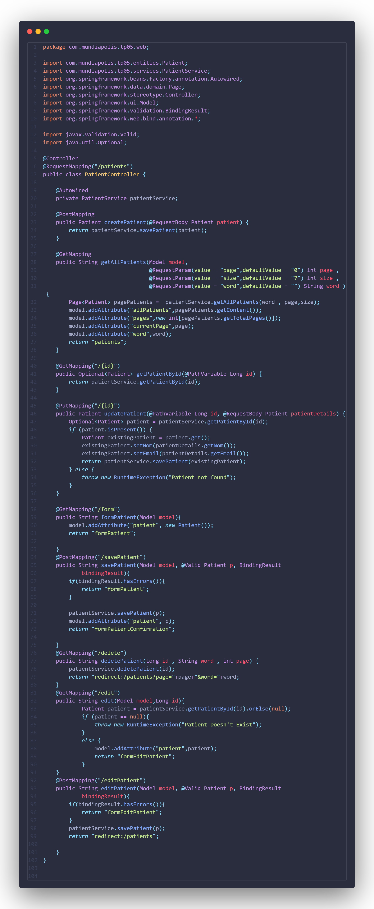
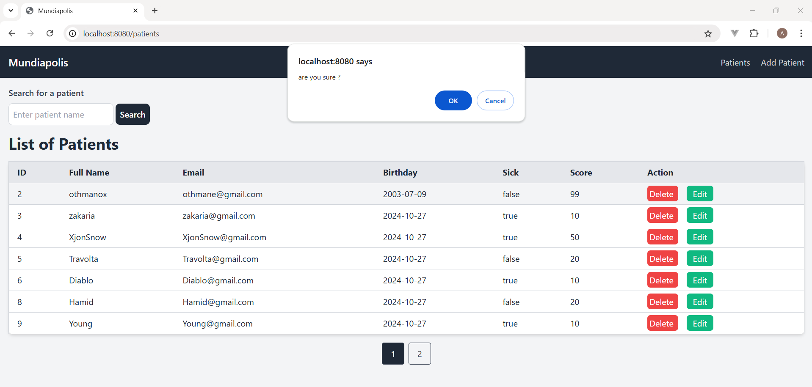

# Introduction
Thymeleaf is a modern server-side Java template engine that’s widely used for web applications. In spring, it seamlessly integrates with the Spring Framework, allowing developers to create dynamic and responsive web pages. With Thymeleaf, you can easily bind data, create forms, and use conditional logic in your HTML templates. Its user-friendly syntax makes it easy to work with, enhancing both development efficiency and the overall user experience. Spring is the perfect time to explore Thymeleaf’s features and take your web applications to the next level!

# Project Structure

# Entity

# Repository

# Service

# Controller

# Application properties

# Template using Thymeleaf 
## File

## Test

