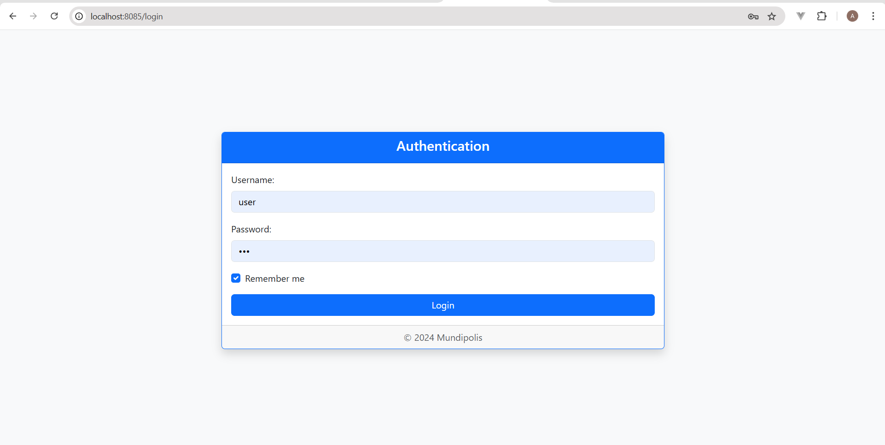
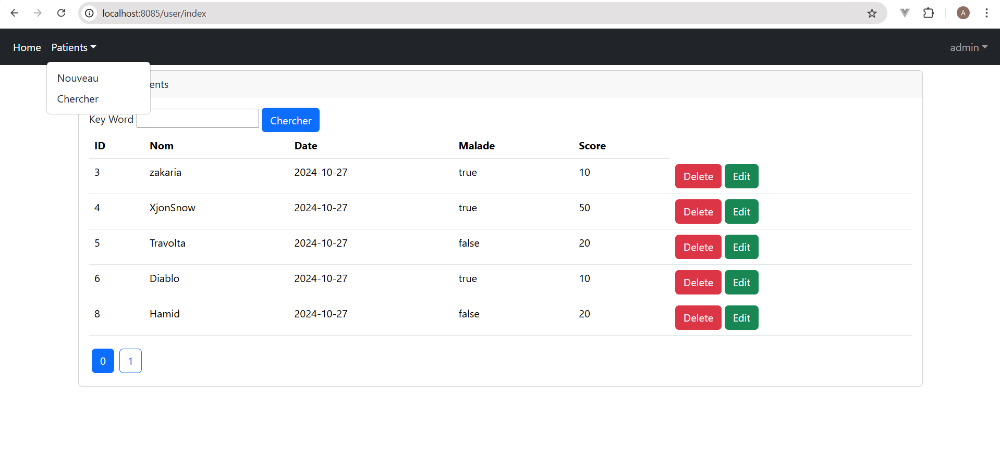
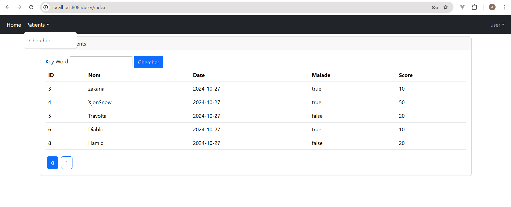
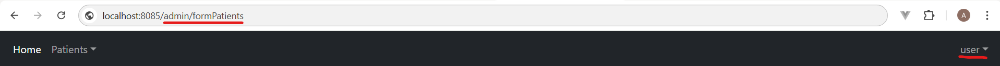
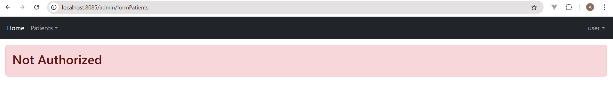

# Spring Security
Spring Security is a powerful and highly customizable framework within the Spring ecosystem designed to handle authentication, authorization, and other security-related tasks for Java-based applications. It provides robust mechanisms to protect applications from security threats and simplifies the process of securing both web and RESTful APIs.

Run the server on : `http://localhost:8085/`

## Access the Application

   - **User**: `user`, Password: `user`
   - **Admin**: `admin`, Password: `admin`

## Routes

- `/user/index`: List patients (accessible by `USER` and `ADMIN` roles).
- `/admin/formPatients`: Add a new patient (accessible by `ADMIN` role).
- `/admin/editPatient`: Edit a patient (accessible by `ADMIN` role).
- `/admin/delete`: Delete a patient (accessible by `ADMIN` role).
- `/login`: Login page.
- `/notAuthorized`: Access denied page.

## Screenshots

- **Login Page**

- **Admin Panel**

- **User Panel**

- **Trying to Access Admin Page**

- **Access Denied**

